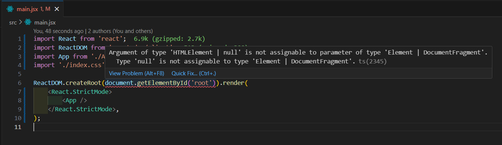
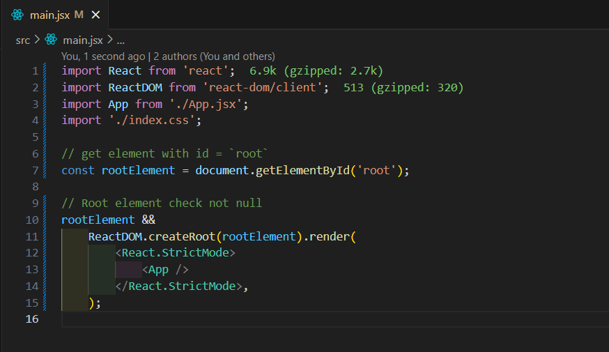

# React + Vite

## Description

-   This is Project use Vite to create a new ReactJS application

## Some notes

### 1. File main.jsx have error when use `eslint` to check code



-   The solution to this problem is to make sure rootElement is not null.



### 2. Enable Open Browser when run app

-   In file _**`vite.config.js`**_ add **server** property to _`defineConfig`_

```js
// vite.config.js file
import { defineConfig } from 'vite';
export default defineConfig({
    // ...
    server: {
        // Open Browser when start `npm run dev`
        open: true,
        // Set port to listen on 3000
        port: 3000,
    },
    // ...
});
```

### 3. Add custom Aliases

-   In file **`vite.config.js`** add your aliases.

```js
// vite.config.js

import { defineConfig } from 'vite';
import path from 'path';

export default defineConfig({
    // ...
    resolve: {
        // change alias
        alias: {
            // @ <---> `./src`
            '@': path.resolve(__dirname, './src'),
            // @component <---> `./src/component`
            '@component': `${path.resolve(__dirname, './src/components')}`,
            // @pages <---> src/pages
            '@pages/*': path.resolve(__dirname, './src/pages'),
        },
        // ...
    },
});
```

-   In file **`jsconfig.json`** or **`tsconfig.json`** (if the file does not exist then create a new config file) append this code under compiler options.

```json
{
    // ...
    "compilerOptions": {
        // ...
        "baseUrl": ".",
        "paths": {
            // @ <---> src/ || dist/
            "@/*": ["src/*", "dist/*", ""],
            // @components  <---> src/components
            "@components/*": ["src/components/*"],
            // @pages <---> src/pages
            "@pages/*": ["src/pages/*"]
        }
        // ...
    }
}
```

-   Now you can use the custom aliases

```js
import HeaderComponent from '@components/HeaderComponent';
import HomePage from '@pages/HomePage';
import images from '@/assets/images/';
```

### 4. Deploy to github pages by gh-pages library

-   Install the gh-pages

    ```bash
    npm install gh-pages
    ```

-   set `base` path to the base directory of the gh-pages in `vite.config.js` file.

    ```diff
    export default defineConfig({
    +   base: '/[name_of_repo_in_github]',
    });

    ```

-   In `package.json` file, set properties like below
    ```diff
    scripts: {
    +   "predeploy": "npm run build",
    +   "deploy": "gh-pages -d dist",
    +   "homepage": "https://[name_of_github].github.io/[name_of_repo_in_github]"
    }
    ```

### 5. Example of configuration

-   **_vite.config.ts_**

    ```ts
    import { defineConfig } from 'vite';
    import react from '@vitejs/plugin-react-swc';
    import path from 'path';

    // https://vitejs.dev/config/
    export default defineConfig({
        // deploy on github pages => repo name: stream-video
        // if in development => base is `./`
        // if in production => base is `/stream-video` name of repo
        base: process.env.NODE_ENV === 'development' ? './' : '/stream-video',

        plugins: [react()],
        resolve: {
            // set alias
            alias: {
                '~': path.resolve(__dirname, './src'),
                '~components': `${path.resolve(__dirname, './src/components')}`,
                '~pages': path.resolve(__dirname, './src/pages'),
            },
        },
        server: {
            open: true, // open browser when run dev
            port: 3000, // open at port 3000
        },
        preview: {
            port: 8080, // review at port 8080
        },
    });

    // If can't use process. Need install `@types/node`
    // npm install --dev @types/node
    ```

-   **_tsconfig.json_**

    ```json
    {
        "compilerOptions": {
            "target": "esnext", //esnext
            "useDefineForClassFields": true,
            "lib": ["esnext", "DOM", "DOM.Iterable"],
            "module": "esnext",
            "skipLibCheck": true,

            /* Bundler mode */
            "moduleResolution": "node",
            "allowImportingTsExtensions": true,
            "allowSyntheticDefaultImports": true,
            "resolveJsonModule": true,
            "isolatedModules": true,
            "noEmit": true,
            "jsx": "react-jsx",
            "checkJs": true,
            "baseUrl": "./", // for absolute imports
            "paths": {
                "~/*": ["src/*", "dist/*", "/"],
                "~components/*": ["src/components/*"],
                "~pages/*": ["src/pages/*"],
                "~hooks/*": ["src/hooks/*"],
                "~layouts/*": ["src/layouts/*"],
                "~assets/*": ["src/assets/*"],
                "~images/*": ["src/assets/images/*"]
            },

            /* Linting */
            "types": ["vite/client", "react", "react-dom", "react-router", "react-router-dom", "node"],
            "strict": true,
            "noUnusedLocals": true,
            "noUnusedParameters": true,
            "noFallthroughCasesInSwitch": true
        },
        "include": ["src/**/*"],
        "exclude": ["node_modules", "dist", "vite.config.ts"],
        "references": [{ "path": "./tsconfig.node.json" }]
    }
    ```

-   **_tsconfig.node.json_**

    ```json
    {
        "compilerOptions": {
            "composite": true,
            "skipLibCheck": true,
            "module": "ESNext",
            "moduleResolution": "bundler",
            "allowSyntheticDefaultImports": true,
            "noImplicitAny": false
        },
        "include": ["vite.config.ts"]
    }
    ```

-   If you want to use `any` type in ts add `'@typescript-eslint/no-explicit-any': 'off',` to **`.eslintrc.cjs`** file

    ```cjs
    module.exports = {
        root: true,
        env: { browser: true, es2020: true, node: true },
        extends: [
            'eslint:recommended',
            'plugin:@typescript-eslint/recommended',
            'plugin:react-hooks/recommended',
            'plugin:react/recommended',
            'plugin:react/jsx-runtime',
        ],
        ignorePatterns: ['dist', '.eslintrc.cjs'],
        parserOptions: { ecmaVersion: 'latest', sourceType: 'module' },
        parser: '@typescript-eslint/parser',
        plugins: ['react-refresh'],
        rules: {
            'react-refresh/only-export-components': ['warn', { allowConstantExport: true }],
            '@typescript-eslint/no-explicit-any': 'off',
        },
    };
    ```
